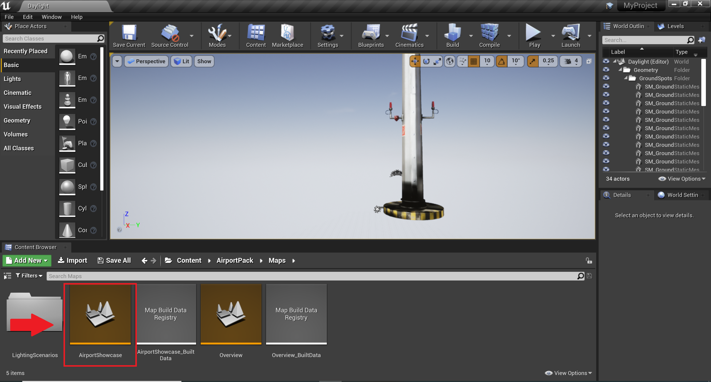
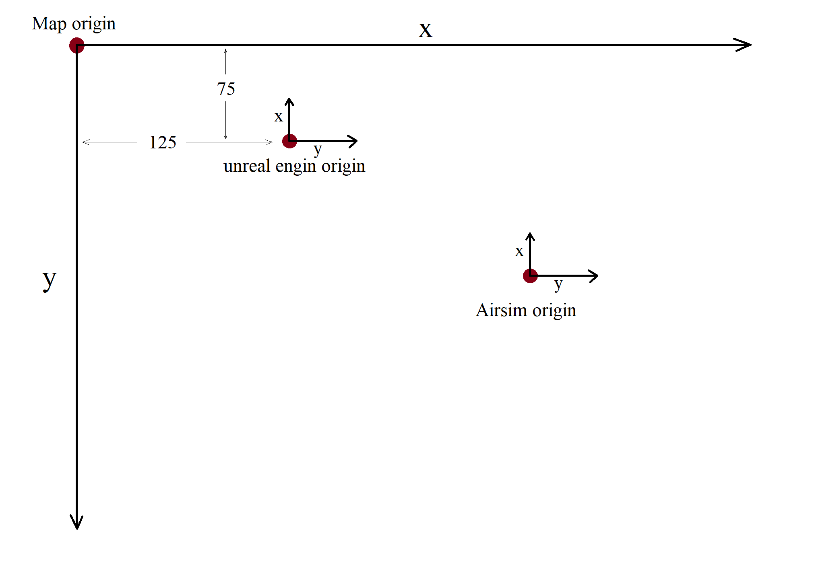
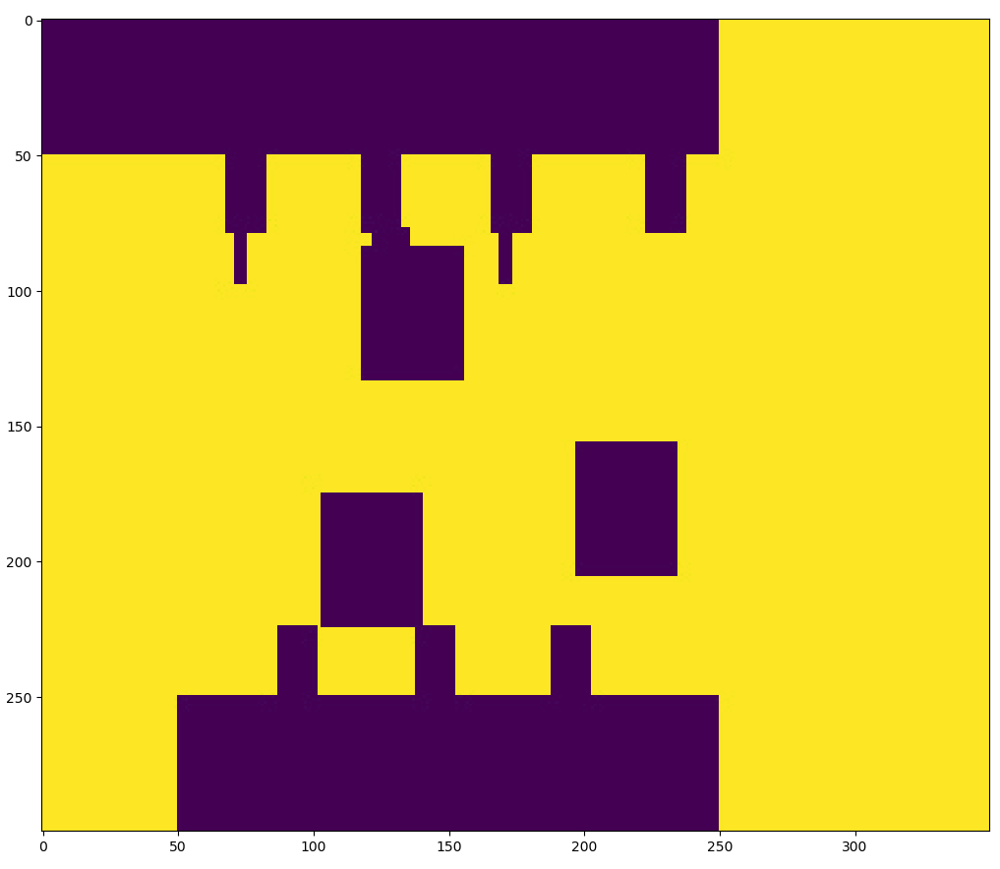
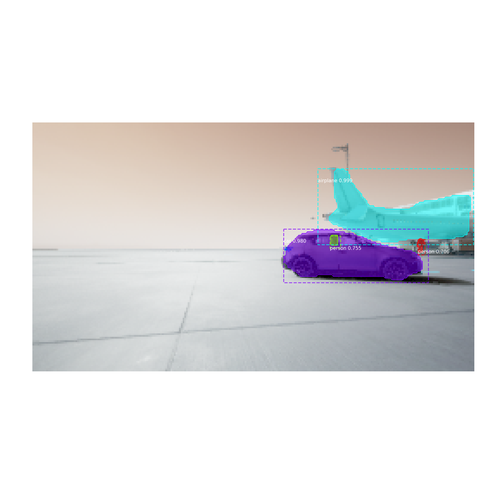
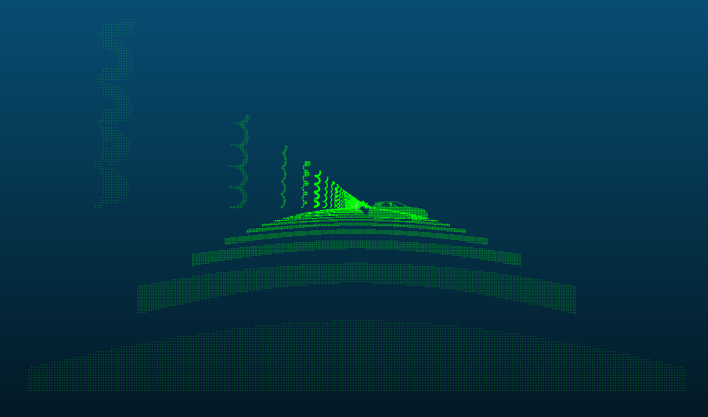
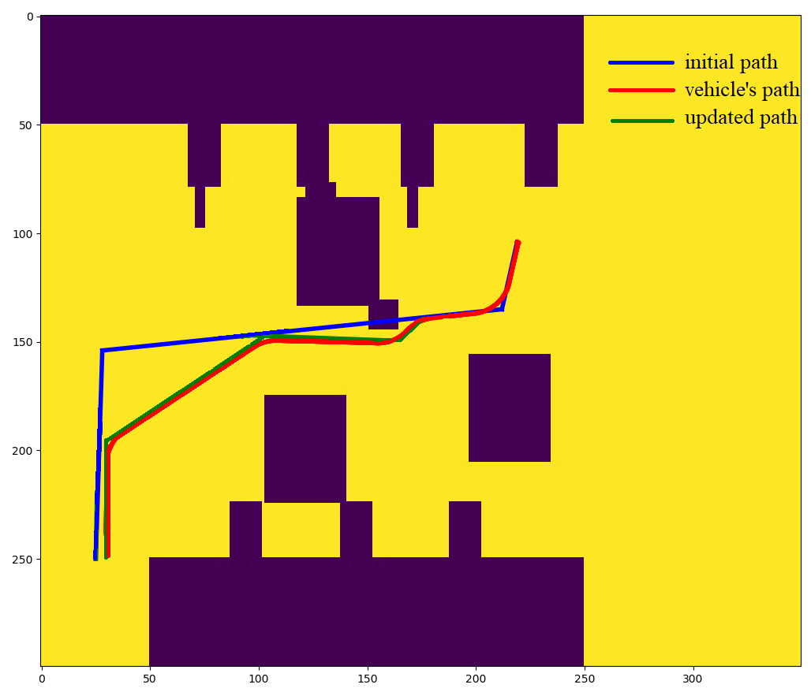

<!-- PROJECT SHIELDS -->
<!--
*** I'm using markdown "reference style" links for readability.
*** Reference links are enclosed in brackets [ ] instead of parentheses ( ).
*** See the bottom of this document for the declaration of the reference variables
*** for contributors-url, forks-url, etc. This is an optional, concise syntax you may use.
*** https://www.markdownguide.org/basic-syntax/#reference-style-links
-->

[![LinkedIn][linkedin-shield]][linkedin-url]

<!-- PROJECT LOGO -->
 

  

  <h3 align="center">Machine Learning based Perception for Optimal Motion Planning and Control</h3>

  

    Niyousha Rahimi, RAIN Lab University of Washington
     
    <a href="#usage">View Demo</a>
    ·
    <a href="https://github.com/NiyoushaRahimi/UW-MLP/issues">Report Bug</a>
  

<!-- TABLE OF CONTENTS -->

  
Table of Contents

  <ol>
    <li>
      <a href="#about-the-project">About The Project</a>
      </li>
      <li>
      <a href="#Requirements">Requirements</a></li>
      </ul>
    </li>
    <li>
      <a href="#getting-started-with-unreal-engin">Getting Started with Unreal Engin</a></li>
       <ul>
        <li><a href="#Building-initial-map">Building the initial map</a></li>
       </ul>
    <li><a href="#main-project">Main Project</a></li>
    <li><a href="#usage">Usage</a></li>
    <li><a href="#roadmap">Roadmap</a></li>
    <li><a href="#contact">Contact</a></li>
    <li><a href="#acknowledgements">Acknowledgements</a></li>
  </ol>

<!-- ABOUT THE PROJECT -->
## About The Project

In this work, a Machine Learning based perception module is developed using Mask-RCNN (and Bayesian Neural Networks) with RGB-D images to estimate the position of objects in an Unreal Engin environment. Two methods are offered for autonomous navigation:

* Sampling based approaches such as RRT^* and Astar 
* stochastic optimal control: Successive convexification for path planning.

It should be mentioned that some parts of the project is still under development.

## Requirements

Main requirements are as follows:
* [Unreal Engin 4.25.3](https://www.unrealengine.com/en-US/download)
* [Airsim](https://github.com/microsoft/AirSim)
* Tensorflow-gpu 1.13 (could work with v1.15)
* Keras 2.1.6

GPU and processor I used:

Intel(R) Core(TM) i7-8850H CPU @  2.60 GHz, 2592 Mhz, 6 Core(s),  12  Logical Processor(s) 

Nvidia Quadro P2000

<!-- GETTING STARTED -->
## Getting Started with Unreal Engin

Please download and install unreal engin. 
I have created an unreal engine environment of an airport. This environment can be downloaded from here: 
* [Airport environment](https://drive.google.com/file/d/1zUhz1Me5F2KKPsuPvBpftNABcb4D2hnI/view?usp=sharing)

Make sure to load AirportShowcase and hit play before running any code.

### Building the initial map

There are three frame of references we need to consider:
1. Unreal-engin coordinate frame
2. The moving vehicle coordinate frame (the origin of the airsim's coordinate frame is placed at the position of camera when the simulation was started)
3. The map's coordinate frame

The following figure demonstrates these coordinate frames and their origins:

Code is provided in map.py for building an initial occupancy map.

## Main project

The main project is carried out in car-sim.py.

Please update root-directory in Mask_RCNN.py and car_sim.py.

Given the inirtial occupancy map, RRT^* is used to generate a path from the start point (300,50) to the end point (25,250).
When the vehicle reaches the vacinity of the unknown-obstacle, it starts processing images taken from the scene. Maks-RCNN is used to detect the obstacle in the image, then depth map is used to determin the position of the unknown-obstacle. The map is then updated using this information, and a new path is generated. 
The vehicle then follows the new path to the goal location.

<!-- USAGE EXAMPLES -->
## Usage
Here's a demo of the simulation:

<a href="https://github.com/NiyoushaRahimi/UW-MLP/blob/main/Images/demo.mp4">View Demo</a>

<!-- ROADMAP -->
## Roadmap
Please look out for these updates in coming days:

1. debugging successive convexification for path planning.
3. using Bayesian NN to predict accuracy of the estimates.

<!-- CONTACT -->
## Contact

Niyousha Rahimi - nrahimi@uw.edu

RAIN Lab, University of Washington

<!-- MARKDOWN LINKS & IMAGES -->
<!-- https://www.markdownguide.org/basic-syntax/#reference-style-links -->

[linkedin-shield]: https://img.shields.io/badge/-LinkedIn-black.svg?style=for-the-badge&logo=linkedin&colorB=555
[linkedin-url]: https://www.linkedin.com/in/newsha-rahimi/
[product-screenshot]: images/screenshot.png
